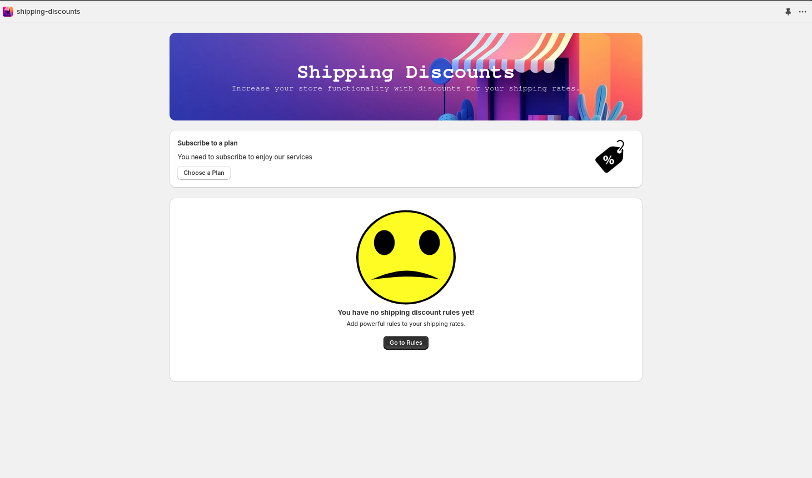
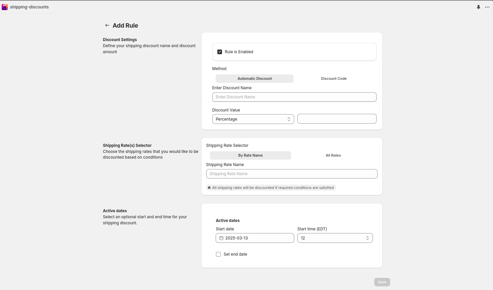
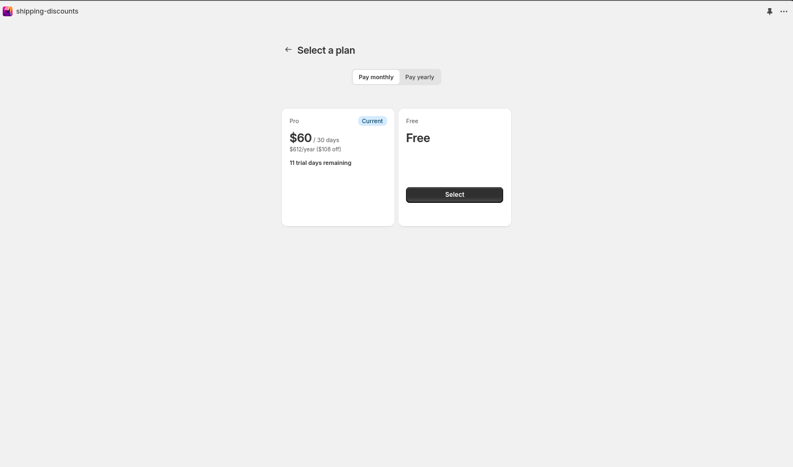
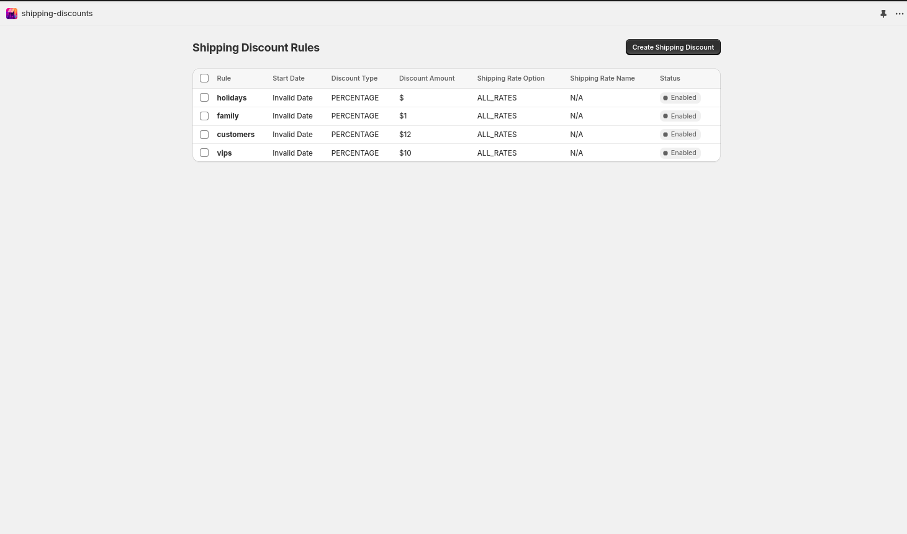

# Shopify Shipping Discounts App







## Overview

This Shopify app, built using Remix and Shopify Functions, allows store owners to create custom shipping discounts for Shopify shipping rates. The app integrates with Shopify's backend to apply discounts based on different conditions and criteria, providing a flexible and dynamic way to manage shipping costs.

## Features

- Create and manage custom shipping discounts.
- Integrates with Shopify Functions to apply discounts to shipping rates.
- Supports various conditions for applying shipping discounts (e.g., cart value, specific products, shipping zones).
- User-friendly interface built with Remix for an efficient admin experience.
- Real-time updates for shipping discounts applied to customer orders.

## Requirements

Before installing the app, ensure you have the following:

- A Shopify store with access to the Shopify Admin API and the ability to install custom apps.
- Node.js (preferably v16.x or higher).
- An active Shopify Partner account.

## Installation

### 1. Clone the Repository

Start by cloning the repository to your local machine:

```bash
git clone app

cd shopify-shipping-discounts-app

npm install

shopify app config link

shopify app env pull

shopify app deploy

npm run dev
```
